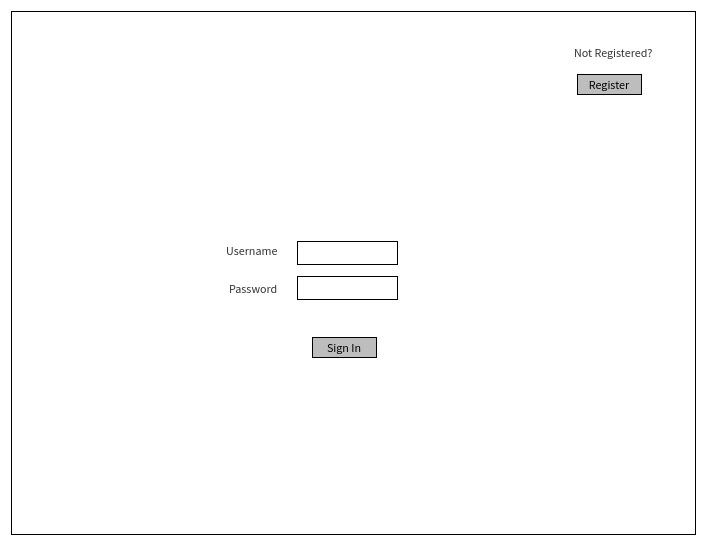
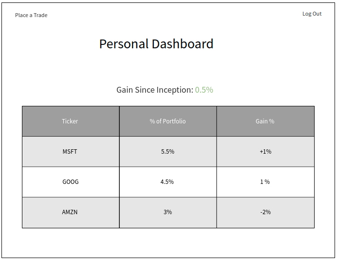
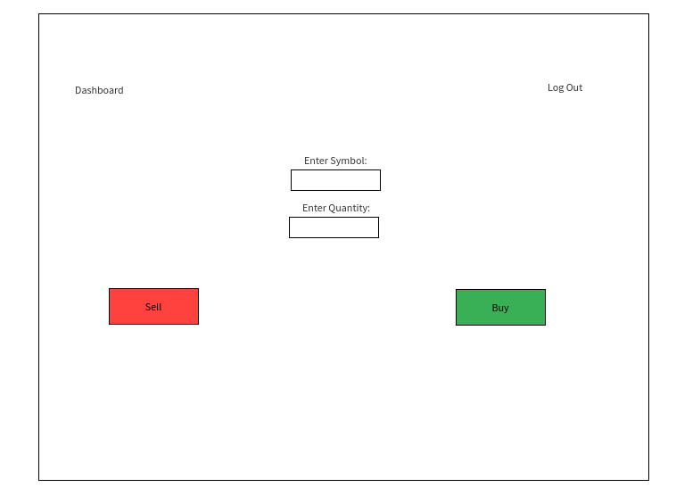
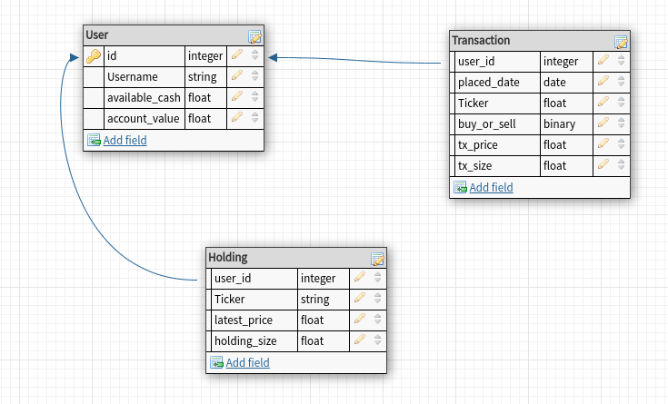

# Stonkhub

The paper-trading (fake money) social network. Place trades, track your performance, share ideas with others.

**MVP Goals** 

* authentication/authorization
* Place Trade + comment on trade
* Track user’s own performance

**Stretch Goals**  

* lookup other users, view performance, view trades
* follow other users
* add friend, create and join discussion groups

  
    *Daily Sprints*
    - Monday:
      * test API
      * wireframe app
      * plan database ERD
      * plan routes
    - Tuesday:
      * create db models -- test db
      * stub routes -- test routes
      * build routes
    - Wednesday:
      * finish routes
      * create views
    - Thursday:
      * finish views
      * mvp
    - Friday:
      * debug refactor
      * style views
    - Saturday:
      * style views
      * stretch goals
    - Sunday:
      * stretch goals

 **Wireframes**
  - Use a tool like https://awwapp.com/, https://www.mockflow.com/, or good ol zoom whiteboard to create wireframes for your project. Whatever you use, get a screen cap.
  - Your wireframes should walk the reader through the screen states, and should include short descriptions of each screen. It's a good idea to give your wireframes labels (like 1, 2, 3 etc), and to indicate which screens transitions to which other screens.
  - Move your image files into the project folder and link them in your README. (You might want to put all your wireframe images into a single folder called images or assets. In that case you'll have to specify the filepath to those images including the containing folder.) Pro tip: use VScode's markdown previewer!

 **ERDs**

  

